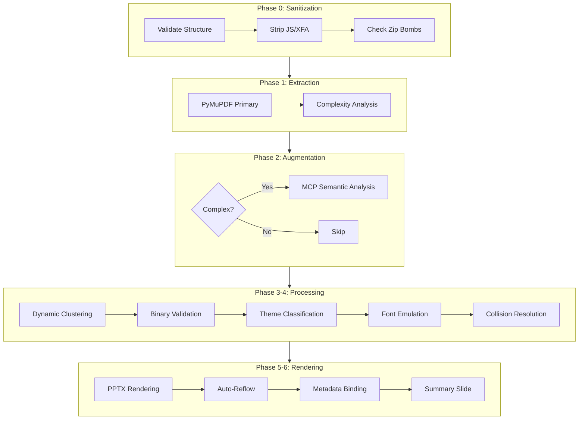
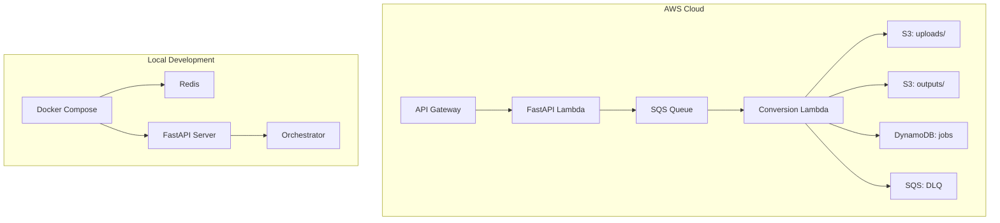

# Architecture Deep Dive

## System Architecture

### High-Level Flow

```mermaid
flowchart LR
    User[User/API Client] -->|POST /v1/convert| FastAPI[FastAPI Ingress]
    FastAPI -->|Upload PDF| S3[S3 Bucket]
    FastAPI -->|Enqueue| SQS[SQS Queue]
    SQS -->|Trigger| Lambda[Lambda Worker]
    Lambda -->|Download| S3
    Lambda -->|Process| Pipeline[12-Phase Pipeline]
    Lambda -->|Upload PPTX| S3
    Lambda -->|Update Status| DynamoDB[DynamoDB]
    Lambda -->|Webhook| User
    User -->|GET /v1/jobs/{id}| FastAPI
    FastAPI -->|Read Status| DynamoDB
    User -->|GET /v1/jobs/{id}/download| FastAPI
    FastAPI -->|Presigned URL| S3
```

### Pipeline Architecture



### Deployment Architecture



## Data Flow

### Input Processing
1. PDF uploaded via multipart/form-data
2. Magic bytes validated (must start with `%PDF-`)
3. Byte-level scan for JavaScript, XFA, embedded files
4. File stored in ephemeral storage (S3/ramdisk/local)
5. Job record created in DynamoDB/Redis

### Conversion Pipeline

**Phase 0 — Pre-flight Sanitization**
Scans the raw PDF byte stream before any library touches it. Detects zip bombs via compression-ratio analysis (rejects > 100:1), strips JavaScript actions and XFA form structures, and removes embedded file streams. This phase is pure byte inspection — no rendering, no parsing.

**Phase 1 — PyMuPDF Primary Extraction**
Opens the PDF with PyMuPDF (`fitz`) and extracts every page's text blocks, images, vector drawings, and annotations. Computes per-block bounding boxes in PDF points, font metadata (name, size, flags), and page dimensions. A complexity score is derived from block count, page count, and vector path density to determine whether augmentation is needed.

**Phase 2 — MCP Augmentation (Selective)**
If Phase 1's complexity score exceeds the threshold, the MCP (Model Context Protocol) semantic analyzer is invoked. It performs table detection, heading hierarchy inference, and column layout analysis. Hard-capped at 10 MCP calls per document to bound latency and cost. Simple documents (single-column text, no tables) skip this phase entirely.

**Phase 3 — Dynamic Clustering**
Groups extracted blocks into logical slide candidates. Uses spatial proximity (vertical gaps > 1.5× line height split clusters) and semantic signals from Phase 2 (heading boundaries, table regions). Produces a list of `Cluster` objects, each tagged with a layout type (title, body, table, figure, multi-column).

**Phase 4 — Binary Validation**
Every cluster tagged as a table is cross-validated against raw block data. If the cluster contains fewer than 2 columns or fewer than 2 rows, the table tag is stripped and the cluster is reclassified as body text. This eliminates hallucinated tables that MCP sometimes produces from tab-indented text.

**Phase 4.5 — Semantic Theme Classification**
Analyzes cluster content to assign semantic themes: title slide, section header, content body, data table, figure+caption, or divider. Theme assignments drive downstream font, color, and layout decisions. Falls back to heuristic rules if the classifier is unavailable.

**Phase 4.6 — Font Metric Emulation**
Recalculates text metrics for PPTX rendering. Maps PDF font sizes to EMU-based PPTX font sizes, applies line-height multipliers (1.2× for body, 1.0× for titles), and adjusts for bold/italic flags lost during extraction. Emits per-run shape dimensions that fit the target slide width without overflow.

**Phase 4.7 — Collision Resolution**
Detects overlapping text shapes within a cluster and shifts them to prevent visual collisions. Uses a sweep-line algorithm sorted by Y-then-X coordinates. Overlapping pairs are separated by the minimum delta needed to eliminate intersection, preserving relative positioning as closely as possible.

**Phase 5 — PPTX Rendering**
Creates the actual PowerPoint file. Each cluster becomes one or more slides. Layout is chosen from a set of master slide templates based on the cluster's layout type. Text boxes, tables, and image placeholders are populated with exact coordinates converted from PDF points to EMU. Charts and vector graphics are rasterized at 2× resolution for crisp display.

**Phase 5.5 — Auto-Reflow Grouping**
Post-render pass that detects oversized content clusters spanning more than one slide. Splits them at natural break points (paragraph boundaries, section headings) and redistributes content across multiple slides while maintaining reading flow and visual hierarchy.

**Phase 5.6 — Metadata Preservation**
Binds source metadata into the PPTX: PDF filename as document title, page numbers as slide notes, creation date, and author if available. Also embeds a conversion provenance record (tool version, timestamp, pipeline phase timestamps) into custom document properties.

**Phase 6 — Conversion Summary Slide**
Appends a final slide summarizing the conversion: total pages processed, total elements extracted, any degraded items, MCP calls made, and total processing time. Provides at-a-glance quality assurance without opening the source PDF.

### Output Delivery
1. PPTX generated with summary slide
2. Uploaded to S3 with presigned URL
3. Status updated in DynamoDB
4. Webhook callback sent if configured
5. Input PDF securely wiped

## Error Handling

### Graceful Degradation
Every layer has try/except with fallback:
- MCP unavailable → PyMuPDF only
- Redis unavailable → in-memory queue
- S3 unavailable → local storage
- Theme mapper unavailable → default colors
- Font emulation unavailable → original fonts

### Dead Letter Queue
- Jobs failing 2+ times routed to DLQ
- 7-day retention for debugging
- Manual retry via `POST /v1/dlq/{id}/retry`

## Security Model

### Pre-flight Sanitization
- Strip JavaScript, XFA forms, embedded files
- Detect zip bombs (compression ratio > 100:1)
- Validate cross-reference table integrity

### Ephemeral Storage
- Input PDFs wiped after successful conversion
- S3 objects encrypted (SSE-S3)
- Lifecycle rules: uploads 1 day, outputs 7 days

### Container Security
- Non-root user in Docker
- Minimal base image (`python:3.11-slim`)
- No unnecessary packages

## Performance Characteristics

### Throughput
| Concurrency | Throughput |
|-------------|------------|
| 1 worker | ~0.75 conv/s |
| 5 workers | ~3.5 conv/s |
| Lambda auto-scale | up to 1000 concurrent |

### Memory
| Metric | Value |
|--------|-------|
| Peak per conversion | ~149 MB |
| Lambda allocation | 1024 MB |
| Docker limit | 512 MB |

### Latency by Document Size
| Document Size | Pages | Latency |
|---------------|-------|---------|
| Small | 1 | ~2.5s |
| Medium | 10 | ~5s |
| Large | 50 | ~15s |
| Very large | 492 | ~84s |

## Testing Strategy

### Unit Tests
- Phase 1 coordinate accuracy (±1 EMU)
- Font metric recalculation
- Collision detection math
- Sanitization regex patterns

### Integration Tests
- 51-document academic curriculum
- 10 organic hostile PDFs
- 20-request concurrency stress test

### CI/CD Gates
- Structural integrity ≥ 99.7%
- Zero table hallucination false positives
- All organic hostile PDFs pass
- No memory leaks under concurrency
