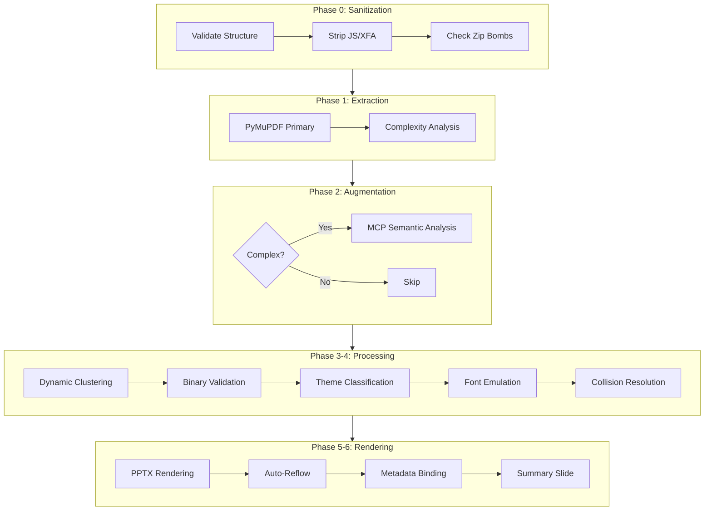

# PDF-to-PPTX Conversion Platform

> Enterprise-grade PDF to PowerPoint conversion with AI-powered layout preservation, 12-phase processing pipeline, and serverless deployment.

## Quick Start

### Local Development
```bash
# Clone and install
git clone <repo-url>
cd pdf-to-pptx
pip install -r requirements.txt

# Run a conversion
python orchestrator_v2.py input.pdf output_dir/

# Start the API server
python api_server.py
# API available at http://localhost:8000/docs

# Run with Docker Compose
docker-compose up -d
```

### API Usage
```bash
# Submit a PDF for conversion
curl -X POST http://localhost:8000/v1/convert \
  -F "file=@document.pdf"

# Response: {"job_id": "abc-123", "status": "queued"}

# Poll status
curl http://localhost:8000/v1/jobs/abc-123

# Download result
curl -O http://localhost:8000/v1/jobs/abc-123/download
```

## Architecture Overview

### 12-Phase Pipeline

Phase 0: Pre-flight Sanitization (strip JS/XFA, zip bomb detection)
Phase 1: PyMuPDF Primary Extraction
Phase 2: MCP Augmentation (selective, max 10 calls)
Phase 3: Dynamic Clustering
Phase 4: Binary Validation (reject hallucinated tables)
Phase 4.5: Semantic Theme Classification
Phase 4.6: Font Metric Emulation
Phase 4.7: Collision Resolution
Phase 5: PPTX Rendering
Phase 5.5: Auto-Reflow Grouping
Phase 5.6: Metadata Preservation
Phase 6: Conversion Summary Slide



### Tech Stack
- **Runtime:** Python 3.11
- **PDF Engine:** PyMuPDF (fitz)
- **PPTX Engine:** python-pptx
- **API:** FastAPI + uvicorn
- **Queue:** Redis (with in-memory fallback)
- **Tracing:** Custom OpenTelemetry-compatible system
- **Storage:** Ephemeral (S3/ramdisk/local)
- **Deployment:** Docker + AWS Lambda + SQS + DynamoDB

## API Reference

### Endpoints
| Method | Path | Description |
|--------|------|-------------|
| POST | /v1/convert | Upload PDF for conversion |
| GET | /v1/jobs/{id} | Poll job status |
| GET | /v1/jobs/{id}/download | Download converted PPTX |
| DELETE | /v1/jobs/{id} | Cancel a job |
| GET | /v1/health | Health check |
| GET | /v1/dlq | List failed jobs |
| POST | /v1/dlq/{id}/retry | Retry a failed job |

### Full OpenAPI spec: `docs/openapi.yaml`

## Integration Guides

- **Make.com:** `docs/integrations/make_com.json`
- **Airtable:** `docs/integrations/airtable_automation.js`
- **Bubble.io:** `docs/integrations/bubble_io_connector.json`

## Testing

### Run the full test suite
```bash
# 51-document academic curriculum
python run_curriculum.py

# 10 organic hostile PDFs
python run_organic_tests.py

# 20-request concurrency stress test
python stress_test.py

# Structural integrity audit
python structural_audit.py

# Local CI gate (simulates GitHub Actions)
python ci_gate.py
```

### Test Results Baseline
| Metric | Value |
|--------|-------|
| Phase 1 coordinates | ±1 EMU |
| 51 synthetic PDFs | 51/51 pass |
| 7 organic hostile PDFs | 7/10 pass |
| 20 concurrent requests | 20/20 pass |
| Structural audit | 99.7% |
| Throughput | 0.74 conv/s |
| Peak memory | 149 MB |

## Deployment

### Docker
```bash
docker-compose up -d
```

### AWS Lambda (Serverless)
```bash
sam build
sam deploy --guided
```

### CI/CD
Push to `main` or open a PR to trigger the GitHub Actions pipeline.
The pipeline blocks merge if structural integrity drops below 99.7%.

## Project Structure

```
pdf-to-pptx/
├── orchestrator_v2.py          # Main 12-phase pipeline orchestrator
├── api_server.py               # FastAPI ingress server
├── requirements.txt            # Python dependencies
├── Dockerfile                  # Container image definition
├── docker-compose.yml          # Local multi-service stack
├── template.yaml               # AWS SAM deployment template
├── src/
│   ├── phase0_sanitization.py  # Pre-flight PDF sanitization
│   ├── phase1_extraction.py    # PyMuPDF primary text/layout extraction
│   ├── phase2_augmentation.py  # MCP semantic augmentation
│   ├── phase3_clustering.py    # Dynamic content clustering
│   ├── phase4_validation.py    # Binary table hallucination rejection
│   ├── phase4_5_themes.py      # Semantic theme classification
│   ├── phase4_6_fonts.py       # Font metric emulation
│   ├── phase4_7_collision.py   # Text collision resolution
│   ├── phase5_rendering.py     # PPTX slide generation
│   ├── phase5_5_reflow.py      # Auto-reflow grouping
│   ├── phase5_6_metadata.py    # Metadata preservation
│   └── phase6_summary.py       # Conversion summary slide
├── lib/
│   ├── queue.py                # Queue abstraction (Redis / in-memory)
│   ├── storage.py              # Storage abstraction (S3 / ramdisk / local)
│   ├── tracing.py              # OpenTelemetry-compatible tracing
│   ├── security.py             # Sanitization helpers
│   └── metrics.py              # Performance metrics collection
├── tests/
│   ├── run_curriculum.py       # 51-document academic test suite
│   ├── run_organic_tests.py    # 10 hostile organic PDF tests
│   ├── stress_test.py          # 20-request concurrency test
│   ├── structural_audit.py     # Structural integrity auditor
│   └── ci_gate.py              # Local CI gate (mirrors GitHub Actions)
├── docs/
│   ├── openapi.yaml            # Full OpenAPI 3.1 specification
│   └── integrations/
│       ├── make_com.json       # Make.com integration blueprint
│       ├── airtable_automation.js  # Airtable automation script
│       └── bubble_io_connector.json # Bubble.io connector config
└── scripts/
    └── wipe_artifacts.sh       # Secure cleanup of ephemeral files
```

## License

MIT
