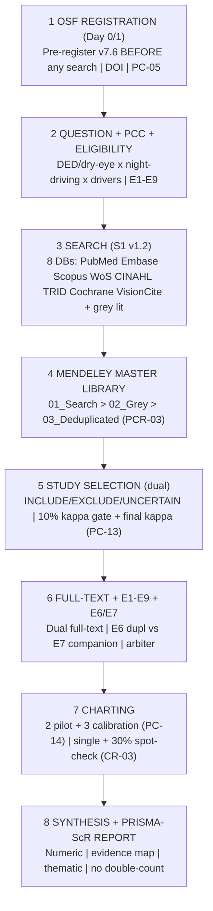
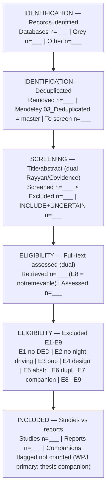
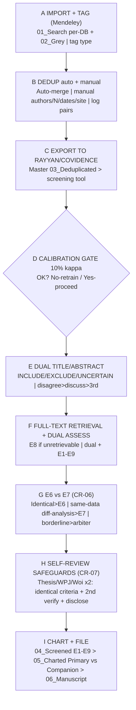

# Scoping Review Protocol v7.6 — Flowcharts (Mermaid source)

## Fig 1 — Protocol Overview

## Fig 2 — PRISMA-ScR Selection Flow (template)

## Fig 3 — Operational Screening Workflow (§12/16/17)

PNGs: `fig1_protocol_overview.png`, `fig2_prisma_scr_flow.png`, `fig3_operational_workflow.png`
Generator: `generate_flowcharts.py` (matplotlib, no external deps)
